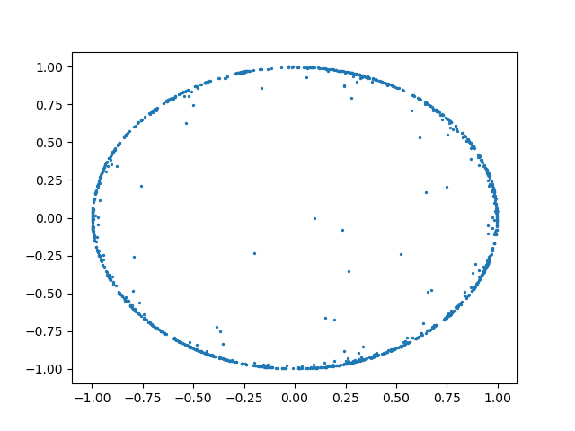

# Poincare Embedding Optimization


The goal of this project was to take an [existing Poincare Embedding](https://radimrehurek.com/gensim/models/poincare.html)
implementation and try to optimize it. I used Numba, CuPy for GPU performance, and a lot of python vectorization to try and achieve faster speeds.

The datasets were retrieved from [Facebook's Poincare Implementation.](https://github.com/facebookresearch/poincare-embeddings/blob/master/wordnet/transitive_closure.py)

An interactive sample where you can hover over points can be found in [sample.html](sample.html)

# Usage

```
from embed import PoincareEmbedding

embedding = PoincareEmbedding(closure, ...params)
embedding.fit_transform(100)

// Access embedding using embedding.embedding

```

# Images
Running on the mammals dataset with 100 negatives, batch size of 1, and 300 epochs.

Epoch 1 (after 10 epochs of burn in with 1/10 the learning rate)


Epoch 30


Epoch 100


Epoch 200


Epoch 300


